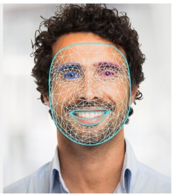
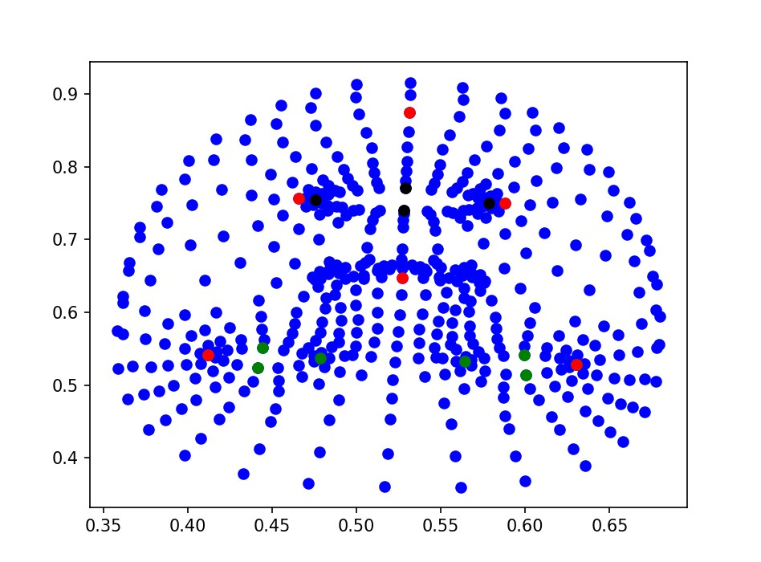
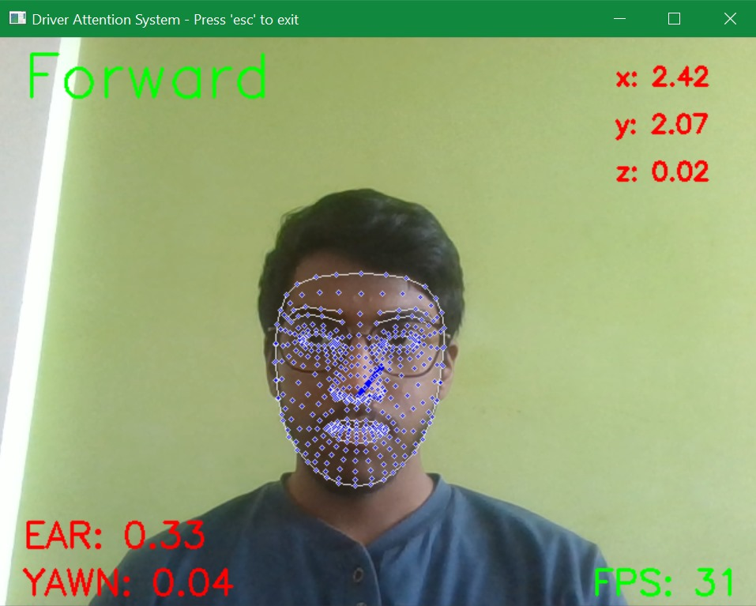
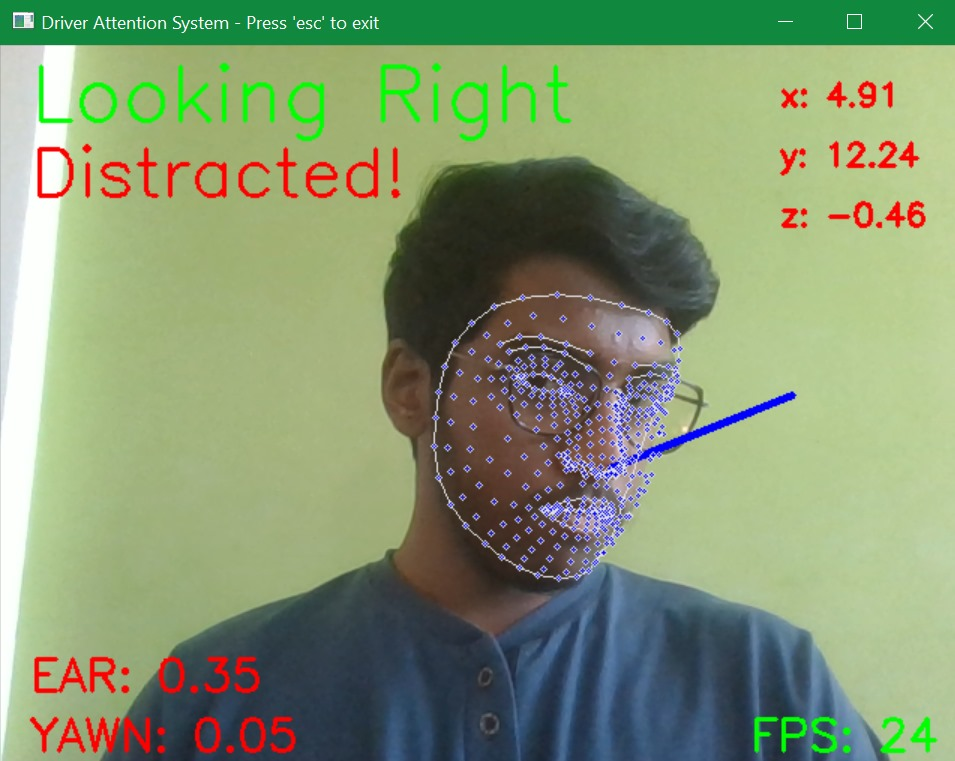
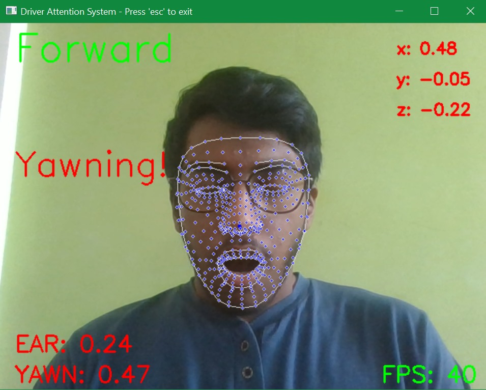

## Driver Drowsiness Detection
Drowsy driver is alerted when he/she is not attentive. The system uses features of non-alertness such as 'Eye closure', 'Yawning', and 'Head pose'.

## Demo

- We use the MediaPipe library which imposes a face mesh to identify points of interest in DDD from the mesh.
<table>
<tbody>
 <tr>
   <td></td>
   <td></td>
 </tr>
</tbody>
</table>

- The Points of interest for driver drowsiness are the eye (green) and mouth (black) points for 'Eye closure detection' and 'Yawn detection' respectively.
- For Head pose estimation we need the following points labelled with red colour.

<table>
<tbody>
 <tr>
   <td></td>
   <td></td>
 </tr>
</tbody>
</table>

---
- Using EAR (Eye Aspect Ratio), the ratio of the height of the eye to the width. If the ratio is less than 
   the threshold of 0.25 for more than 2.5 seconds, the system alerts using an alarm.
- Using the Mouth ratio, if it is more than the threshold of 0.3 for more than 4 seconds, the system alerts the driver.
- Using Solve PnP to find the point where the driver is looking and find if he/she is distracted using the head pose estimation.

<table>
<tbody>
 <tr>
   <td></td>
   <td></td>
 </tr> 
</tbody>
</table>

We get a system where non-attention in a person is detected and is alerted using an alarm.
